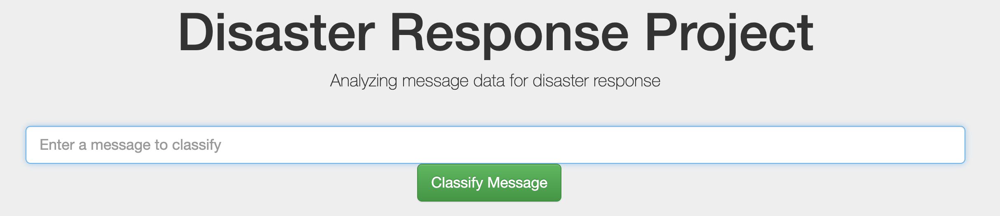

# Disaster Response Pipeline Project

### Motivation

In this project I use data from Figure Eight in order to build a classifier for the categorization of disaster response messages. With the trained classifier I create a web app that takes an input message from the user and outputs a corresponding classification based on all 36 categories.

### Instructions

To run the scripts in this repository you should have a working Python 3 installation on your system. The file `requirements.txt` lists all dependencies that are required to run the scripts in this repository. You can install them using pip:

    pip install -r requirements.txt

Then perform three steps to get the web app running:

1. Run the following commands in the project's root directory to set up your database and model.

    - To run ETL pipeline that cleans data and stores in database 
        `python data/process_data.py data/disaster_messages.csv data/disaster_categories.csv data/DisasterResponse.db`
    
    - To run ML pipeline that trains classifier and saves
        `python models/train_classifier.py data/DisasterResponse.db models/classifier.pkl`

2. Run the following command in the app's directory to run your web app.
    `python run.py`

3. Go to http://0.0.0.0:3001/

### Files

    ├── app
    │   ├── run.py------------------------# flask app for running the app
    │   └── templates
    │       ├── go.html-------------------# classification results page
    │       └── master.html---------------# main page 
    ├── data
    │   ├── disaster_categories.csv-------# raw category data
    │   ├── disaster_messages.csv---------# raw messages 
    │   └── process_data.py---------------# data engineering pipeline
    ├── models
    │   └── train_classifier.py-----------# classification pipeline

### Acknowledgements

Thanks to Udacity and Figure Eight for the great support on this project.
